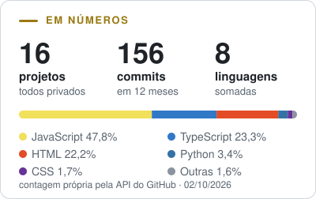

  <picture>
    <source media="(prefers-color-scheme: dark)" srcset="assets/corun-logo-branco.png">
    
  </picture>

<h1 align="center">Bruno Correa</h1>

<b>Máquinas de tatuagem feitas à mão, tintas e cartuchos · Pindamonhangaba (SP)</b>

- **A CORUN:** a oficina das máquinas, as tintas Pure Black, os cartuchos Diamond Series e o Tattoo.doc, uma série com tatuadores.
- **Como eu construo:** a loja, o site, o assistente Satoshi e as automações da CORUN rodam em projetos próprios, feitos com IA (Claude e Codex) e decididos por mim.
- **Aqui:** os projetos são privados. Abaixo, os números deles e as referências que eu sigo.

  <picture>
    <source media="(prefers-color-scheme: dark)" srcset="assets/indicadores-escuro.svg">
    
  </picture>

## CORUN

<table>
  <tr><td><b>Loja</b></td><td><a href="https://loja.corun.com.br/">loja.corun.com.br</a> · máquinas, tintas e cartuchos</td></tr>
  <tr><td><b>História</b></td><td><a href="https://corun.com.br/">corun.com.br</a> · a oficina, o arquivo e o Tattoo.doc</td></tr>
  <tr><td><b>Pure Black</b></td><td><a href="https://corun.com.br/pure-black/">corun.com.br/pure-black</a> · Line Ink e Heavy Ink S</td></tr>
  <tr><td><b>Academy</b></td><td><a href="https://corunacademy.com/diamond/">corunacademy.com/diamond</a> · guia técnico dos cartuchos Diamond Series</td></tr>
  <tr><td><b>CORUN Tattoo</b></td><td><a href="https://corun.com.br/corun-tattoo/">corun.com.br/corun-tattoo</a> · um novo capítulo, em construção</td></tr>
  <tr><td><b>Vídeos</b></td><td><a href="https://www.youtube.com/@coruntattoomachine">youtube.com/@coruntattoomachine</a></td></tr>
  <tr><td><b>Instagram</b></td><td><a href="https://www.instagram.com/coruntattoomachine/">@coruntattoomachine</a></td></tr>
</table>

## Referências que eu sigo

Critério: obra que o mundo usa (ferramenta, livro, curso ou trabalho reconhecido), alcance e atividade em 2026. Cada link foi aberto e conferido em 02/10/2026; o X só entra quando a própria pessoa o declara. Em cripto, são referências para estudar, não indicação de investimento.

<!-- referencias:inicio -->

<b>Tatuagem e tinta</b> · 10

| Quem | Por que é referência | Onde seguir |
|---|---|---|
| **Horiyoshi&nbsp;III** | Mestre do irezumi, a tatuagem tradicional japonesa de corpo inteiro. | [Instagram](https://www.instagram.com/horiyoshi_3/) |
| **Shige** | Do estúdio Yellow Blaze, em Yokohama: irezumi contemporâneo de corpo inteiro. | [Instagram](https://www.instagram.com/shige_yellowblaze/) |
| **Bang&nbsp;Bang** | Keith McCurdy, do estúdio Bang Bang de Nova York, tatuador de grandes nomes da música. | [Instagram](https://www.instagram.com/bangbangnyc/) |
| **Dr.&nbsp;Woo** | Referência mundial do traço fino (fine line), de Los Angeles. | [Instagram](https://www.instagram.com/_dr_woo_/) |
| **Nikko&nbsp;Hurtado** | Um dos maiores nomes do realismo colorido. | [Instagram](https://www.instagram.com/nikkohurtado/) |
| **Bob&nbsp;Tyrrell** | Um dos mestres do realismo em black and grey, de Detroit. | [Instagram](https://www.instagram.com/bobtyrrell/) |
| **Mister&nbsp;Cartoon** | Ícone do black and grey e do lettering chicano de Los Angeles. | [Instagram](https://www.instagram.com/misterctoons/) · [Site](https://www.mistercartoon.com/bio) |
| **Eternal&nbsp;Ink** | Uma das tintas de tatuagem mais usadas no mundo: para acompanhar o mercado. | [Instagram](https://www.instagram.com/eternalink/) · [Site](https://eternalink.com/) |
| **Dynamic&nbsp;Color** | O preto Dynamic é padrão de bancada há décadas: para acompanhar o mercado. | [YouTube](https://www.youtube.com/@DynamicColor) · [Instagram](https://www.instagram.com/dynamiccolor/) · [Site](https://www.dynamiccolor.com/) |
| **World&nbsp;Famous&nbsp;Ink** | Tinta de alcance mundial, com linhas assinadas por tatuadores: para acompanhar o mercado. | [Instagram](https://www.instagram.com/worldfamousink/) |

<b>IA e automação</b> · 10

| Quem | Por que é referência | Onde seguir |
|---|---|---|
| **Andrej&nbsp;Karpathy** | Autor do nanoGPT e do curso *Neural Networks: Zero to Hero*: mostra como um LLM funciona por dentro. | [GitHub](https://github.com/karpathy) · [X](https://x.com/karpathy) · [YouTube](https://www.youtube.com/@AndrejKarpathy) |
| **Andrew&nbsp;Ng** | Fundador da DeepLearning.AI, com os cursos de IA mais assistidos do mundo; mantém o aisuite. | [GitHub](https://github.com/andrewyng) · [X](https://x.com/AndrewYNg) · [YouTube](https://www.youtube.com/@Deeplearningai) · [Site](https://www.andrewng.org/) |
| **Simon&nbsp;Willison** | Criador do Datasette e da ferramenta `llm`; escreve todo dia sobre uso prático e seguro de IA. | [GitHub](https://github.com/simonw) · [X](https://x.com/simonw) · [Blog](https://simonwillison.net/) |
| **Jeremy&nbsp;Howard** | Fundador do fast.ai: a biblioteca e o curso gratuito de deep learning prático. | [GitHub](https://github.com/jph00) · [X](https://x.com/jeremyphoward) · [YouTube](https://www.youtube.com/@howardjeremyp) |
| **Sebastian&nbsp;Raschka** | Autor de *Build a Large Language Model (From Scratch)*; o repositório do livro passa de 100 mil estrelas. | [GitHub](https://github.com/rasbt) · [X](https://x.com/rasbt) · [YouTube](https://www.youtube.com/@SebastianRaschka) |
| **Georgi&nbsp;Gerganov** | Criador do llama.cpp: IA rodando no próprio computador, sem nuvem. | [GitHub](https://github.com/ggerganov) · [X](https://x.com/ggerganov) · [Site](https://ggerganov.com) |
| **Chip&nbsp;Huyen** | Autora de *AI Engineering* e *Designing Machine Learning Systems*: como transformar IA em produto. | [GitHub](https://github.com/chiphuyen) · [X](https://x.com/chipro) · [Site](https://huyenchip.com) |
| **Harrison&nbsp;Chase** | Criador do LangChain, base de boa parte dos agentes de IA. | [GitHub](https://github.com/hwchase17) · [YouTube](https://www.youtube.com/@LangChain) |
| **Jan&nbsp;Oberhauser** | Criador do n8n, automação de fluxos com IA, e quem mais contribuiu no projeto. | [GitHub](https://github.com/n8n-io) · [YouTube](https://www.youtube.com/@n8n-io) |
| **Ethan&nbsp;Mollick** | Professor da Wharton e autor de *Co-Intelligence*: IA aplicada ao trabalho e ao negócio. | [X](https://x.com/emollick) · [One Useful Thing](https://www.oneusefulthing.org/about) |

<b>Programação back-end</b> · 10

| Quem | Por que é referência | Onde seguir |
|---|---|---|
| **Linus&nbsp;Torvalds** | Criou o Linux e o Git, a base de quase todo servidor e de todo controle de versão. | [GitHub](https://github.com/torvalds) |
| **Ryan&nbsp;Dahl** | Criou o Node.js e o Deno: JavaScript no servidor. | [GitHub](https://github.com/ry) · [X](https://x.com/rough__sea) · [Site](https://tinyclouds.org/) |
| **David&nbsp;Heinemeier&nbsp;Hansson** | Criou o Ruby on Rails; cofundador da 37signals (Basecamp e HEY). | [GitHub](https://github.com/dhh) · [X](https://x.com/dhh) · [Blog](https://world.hey.com/dhh) |
| **Guido&nbsp;van&nbsp;Rossum** | Criou o Python, a linguagem mais usada em dados e automação. | [GitHub](https://github.com/gvanrossum) |
| **Salvatore&nbsp;Sanfilippo** | Criou o Redis, o banco em memória mais usado do mundo. | [GitHub](https://github.com/antirez) · [X](https://x.com/antirez) · [Site](https://antirez.com/) |
| **Mitchell&nbsp;Hashimoto** | Cofundador da HashiCorp (Terraform, Vagrant) e criador do terminal Ghostty. | [GitHub](https://github.com/mitchellh) · [X](https://x.com/mitchellh) · [Site](https://mitchellh.com/) |
| **Paul&nbsp;Copplestone** | Cofundador e CEO do Supabase, o Postgres aberto com API pronta. | [GitHub](https://github.com/kiwicopple) · [X](https://x.com/kiwicopple) |
| **ThePrimeagen** | Ex-Netflix; ensina performance e back-end para milhões no YouTube. | [GitHub](https://github.com/ThePrimeagen) · [X](https://x.com/ThePrimeagen) · [YouTube](https://www.youtube.com/@ThePrimeagen) |
| **Fabio&nbsp;Akita** | Um dos maiores divulgadores de programação do Brasil, no canal Akitando. | [GitHub](https://github.com/akitaonrails) · [X](https://x.com/AkitaOnRails) · [YouTube](https://www.youtube.com/@Akitando) |
| **Filipe&nbsp;Deschamps** | Um dos maiores canais de programação do Brasil e criador do TabNews. | [GitHub](https://github.com/filipedeschamps) · [YouTube](https://www.youtube.com/@FilipeDeschamps) |

<b>Programação front-end</b> · 10

| Quem | Por que é referência | Onde seguir |
|---|---|---|
| **Dan&nbsp;Abramov** | Do time do React e criador do Redux; o blog Overreacted explica React por dentro. | [GitHub](https://github.com/gaearon) · [Blog](https://overreacted.io/) |
| **Evan&nbsp;You** | Criou o Vue e o Vite. | [GitHub](https://github.com/yyx990803) |
| **Rich&nbsp;Harris** | Criou o Svelte e o Rollup. | [GitHub](https://github.com/Rich-Harris) |
| **Guillermo&nbsp;Rauch** | Fundador e CEO da Vercel, a empresa do Next.js; criou o Socket.IO. | [GitHub](https://github.com/rauchg) · [X](https://x.com/rauchg) · [Site](https://rauchg.com/) |
| **Adam&nbsp;Wathan** | Criou o Tailwind CSS. | [GitHub](https://github.com/adamwathan) · [X](https://x.com/adamwathan) |
| **shadcn** | Criou o shadcn/ui, os componentes que se copiam para dentro do projeto. | [GitHub](https://github.com/shadcn) · [X](https://x.com/shadcn) |
| **Kent&nbsp;C.&nbsp;Dodds** | Criou a Testing Library; ensina React e web completa (Epic React, Epic Web). | [GitHub](https://github.com/kentcdodds) · [X](https://x.com/kentcdodds) · [Site](https://kentcdodds.com/) |
| **Josh&nbsp;W.&nbsp;Comeau** | Os cursos de CSS e React mais elogiados, com explicações interativas. | [GitHub](https://github.com/joshwcomeau) · [Site](https://www.joshwcomeau.com/) |
| **Addy&nbsp;Osmani** | Engenheiro do Google, por anos à frente do Chrome para desenvolvedores; livros sobre padrões e performance web. | [GitHub](https://github.com/addyosmani) · [X](https://x.com/addyosmani) · [Site](https://addyosmani.com/) |
| **Diego&nbsp;Fernandes** | Cofundador da Rocketseat, a maior escola de programação web do Brasil. | [GitHub](https://github.com/diego3g) · [YouTube](https://www.youtube.com/@rocketseat) |

<b>Design</b> · 10

| Quem | Por que é referência | Onde seguir |
|---|---|---|
| **Paula&nbsp;Scher** | Sócia da Pentagram; marcas como Citi, Windows 8 e o Public Theater. | [Pentagram](https://www.pentagram.com/about/paula-scher) |
| **Michael&nbsp;Bierut** | Sócio da Pentagram; marcas como Mastercard e a campanha de Hillary Clinton. | [Pentagram](https://www.pentagram.com/about/michael-bierut) |
| **Jessica&nbsp;Walsh** | Fundadora do estúdio &Walsh: identidade visual ousada e muito premiada. | [Instagram](https://www.instagram.com/andwalsh/) · [Site](https://andwalsh.com/) |
| **Stefan&nbsp;Sagmeister** | Designer de capas de disco e autor de livros sobre beleza e design. | [Instagram](https://www.instagram.com/stefansagmeister/) · [Site](https://sagmeister.com/) |
| **Aaron&nbsp;Draplin** | Logos e marcas de traço grosso, com o processo aberto. | [Instagram](https://www.instagram.com/draplin/) · [Site](https://www.draplin.com/) |
| **Chris&nbsp;Do** | Fundador do The Futur: negócio, preço e processo de design para quem vive de criação. | [X](https://x.com/theChrisDo) · [YouTube](https://www.youtube.com/@thefutur) · [Instagram](https://www.instagram.com/thechrisdo/) |
| **Jessica&nbsp;Hische** | Lettering e tipografia, com obra para Wes Anderson e para a Penguin. | [Instagram](https://www.instagram.com/jessicahische/) · [Site](https://www.jessicahische.is/) |
| **Seb&nbsp;Lester** | Caligrafia e lettering à mão, base para quem desenha letra em pele. | [YouTube](https://www.youtube.com/@SebLester) · [Instagram](https://www.instagram.com/seblester/) |
| **Sagi&nbsp;Haviv** | Sócio da Chermayeff & Geismar & Haviv, o escritório dos logos da Chase, da NBC e da Mobil. | [Site](https://www.cghnyc.com/) |
| **Fabio&nbsp;Haag** | Designer de tipos brasileiro; fontes para marcas globais pela Fabio Haag Type. | [Instagram](https://www.instagram.com/fabiohaagtype/) · [Site](https://fabiohaagtype.com/) |

<b>UX/UI</b> · 10

| Quem | Por que é referência | Onde seguir |
|---|---|---|
| **Don&nbsp;Norman** | Autor de *O Design do Dia a Dia* e criador do termo experiência do usuário. | [Site](https://jnd.org/) |
| **Jakob&nbsp;Nielsen** | Cofundador do Nielsen Norman Group e das 10 heurísticas de usabilidade. | [YouTube](https://www.youtube.com/@NNgroup) · [Site](https://www.nngroup.com/) |
| **Steve&nbsp;Krug** | Autor de *Não Me Faça Pensar*, o livro de usabilidade mais lido. | [Site](https://sensible.com/) |
| **Brad&nbsp;Frost** | Criou o Atomic Design, o método de sistemas de design. | [GitHub](https://github.com/bradfrost) · [Site](https://bradfrost.com/) |
| **Steve&nbsp;Schoger** | Coautor de *Refactoring UI*: deixar uma tela bonita sem ser designer. | [X](https://x.com/steveschoger) · [Site](https://www.refactoringui.com/) |
| **Luke&nbsp;Wroblewski** | Autor de *Mobile First* e *Web Form Design*. | [X](https://x.com/lukew) · [Site](https://www.lukew.com/) |
| **Julie&nbsp;Zhuo** | Ex-VP de design do Facebook e autora de *The Making of a Manager*. | [X](https://x.com/joulee) · [Site](https://www.juliezhuo.com/) |
| **Dylan&nbsp;Field** | Cofundador e CEO do Figma, a ferramenta de interface mais usada. | [X](https://x.com/zoink) |
| **Vitaly&nbsp;Friedman** | Fundador da Smashing Magazine; ensina UX de formulários, tabelas e e-commerce. | [X](https://x.com/vitalyf) · [Site](https://www.smashingmagazine.com/) |
| **Fabricio&nbsp;Teixeira** | Brasileiro, fundador do UX Collective, uma das maiores publicações de UX do mundo. | [X](https://x.com/fabriciot) · [UX Collective](https://uxdesign.cc/) |

<b>Vídeo e documentário</b> · 10

| Quem | Por que é referência | Onde seguir |
|---|---|---|
| **Ken&nbsp;Burns** | Documentarista de séries históricas; o efeito Ken Burns leva o nome dele. | [X](https://x.com/KenBurns) · [Site](https://kenburns.com/) |
| **Petra&nbsp;Costa** | Brasileira, diretora de *Democracia em Vertigem*, indicado ao Oscar de documentário. | [Instagram](https://www.instagram.com/petracostal/) |
| **Errol&nbsp;Morris** | Documentarista vencedor do Oscar por *Sob a Névoa da Guerra*; mestre da entrevista. | [Site](https://www.errolmorris.com/) |
| **Johnny&nbsp;Harris** | Jornalismo em vídeo com mapas e arquivos; ex-Vox. | [YouTube](https://www.youtube.com/@johnnyharris) · [Instagram](https://www.instagram.com/johnny.harris/) |
| **Casey&nbsp;Neistat** | Mudou a linguagem do vlog e da edição rápida no YouTube. | [YouTube](https://www.youtube.com/@casey) · [Instagram](https://www.instagram.com/caseyneistat/) |
| **Peter&nbsp;McKinnon** | Ensina fotografia, filmagem e edição para milhões de criadores. | [YouTube](https://www.youtube.com/@PeterMcKinnon) · [Instagram](https://www.instagram.com/petermckinnon/) |
| **Film&nbsp;Riot** | Ryan Connolly ensina a fazer cinema de baixo orçamento: roteiro, luz e efeito. | [YouTube](https://www.youtube.com/@filmriot) |
| **Casey&nbsp;Faris** | Ensina DaVinci Resolve no YouTube, da edição à correção de cor. | [YouTube](https://www.youtube.com/@CaseyFaris) |
| **Daniel&nbsp;Schiffer** | Vídeo de produto e transições criativas, com o processo aberto. | [YouTube](https://www.youtube.com/@danielschiffer) |
| **Nerdwriter** | Evan Puschak: ensaios em vídeo sobre como um filme e uma cena funcionam. | [YouTube](https://www.youtube.com/@Nerdwriter1) |

<b>Hackers e segurança</b> · 10

| Quem | Por que é referência | Onde seguir |
|---|---|---|
| **Bruce&nbsp;Schneier** | Criptógrafo e autor de *Applied Cryptography*; o blog de segurança mais respeitado. | [Blog](https://www.schneier.com/) |
| **Troy&nbsp;Hunt** | Criou o Have I Been Pwned: saber se o seu e-mail vazou. | [GitHub](https://github.com/troyhunt) · [X](https://x.com/troyhunt) · [Site](https://www.troyhunt.com/) |
| **Tavis&nbsp;Ormandy** | Pesquisador do Google Project Zero; achou falhas graves em antivírus e em processadores. | [GitHub](https://github.com/taviso) · [X](https://x.com/taviso) |
| **Samy&nbsp;Kamkar** | Autor do worm Samy e de pesquisas de hardware hacking abertas. | [GitHub](https://github.com/samyk) · [X](https://x.com/samykamkar) |
| **Daniel&nbsp;Miessler** | Criou o SecLists e o Fabric (IA para o dia a dia); escreve sobre segurança e IA. | [GitHub](https://github.com/danielmiessler) · [X](https://x.com/DanielMiessler) · [Site](https://danielmiessler.com/) |
| **John&nbsp;Hammond** | Ensina hacking ético, CTF e análise de malware para milhões no YouTube. | [YouTube](https://www.youtube.com/@_JohnHammond) |
| **LiveOverflow** | Ensina como as falhas funcionam por dentro, do binário à web. | [GitHub](https://github.com/LiveOverflow) · [YouTube](https://www.youtube.com/@LiveOverflow) |
| **Marcus&nbsp;Hutchins** | Parou o ransomware WannaCry em 2017; ensina análise de malware. | [YouTube](https://www.youtube.com/@MalwareTechBlog) · [Perfis](https://marcushutchins.com/socials) |
| **Mikko&nbsp;Hyppönen** | Décadas caçando vírus; autor de *If It's Smart, It's Vulnerable*. | [X](https://x.com/mikko) |
| **Fernando&nbsp;Mercês** | Brasileiro, fundador da Mente Binária: engenharia reversa e segurança em português. | [GitHub](https://github.com/merces) · [YouTube](https://www.youtube.com/@mentebinaria) · [Mente Binária](https://www.mentebinaria.com.br/) |

<b>Cripto e bitcoin</b> · 10

| Quem | Por que é referência | Onde seguir |
|---|---|---|
| **Pieter&nbsp;Wuille** | Desenvolvedor do Bitcoin Core; coautor do SegWit e do Taproot. | [GitHub](https://github.com/sipa) |
| **Adam&nbsp;Back** | Criou o Hashcash, citado no artigo do Bitcoin; CEO da Blockstream. | [X](https://x.com/adam3us) |
| **Andreas&nbsp;Antonopoulos** | Autor de *Mastering Bitcoin*, o livro técnico mais usado sobre bitcoin. | [YouTube](https://www.youtube.com/@aantonop) · [Site](https://aantonop.com/) |
| **Jameson&nbsp;Lopp** | Referência em segurança e autocustódia de bitcoin; cofundador da Casa. | [GitHub](https://github.com/jlopp) · [X](https://x.com/lopp) · [Site](https://www.lopp.net/) |
| **Vitalik&nbsp;Buterin** | Cocriador do Ethereum. | [GitHub](https://github.com/vbuterin) · [X](https://x.com/VitalikButerin) · [Blog](https://vitalik.eth.limo/) |
| **Saifedean&nbsp;Ammous** | Autor de *O Padrão Bitcoin*, sobre bitcoin e economia. | [X](https://x.com/saifedean) · [Site](https://saifedean.com/) |
| **Lyn&nbsp;Alden** | Analista de macroeconomia; autora de *Broken Money*. | [X](https://x.com/LynAldenContact) · [Site](https://www.lynalden.com/) |
| **Michael&nbsp;Saylor** | Fundador da Strategy, a empresa aberta com mais bitcoin no caixa. | [X](https://x.com/saylor) · [Site](https://www.strategy.com/) |
| **Willy&nbsp;Woo** | Pioneiro da análise on-chain, os dados da própria rede do bitcoin. | [X](https://x.com/woonomic) · [Site](https://woocharts.com/) |
| **Fernando&nbsp;Ulrich** | Brasileiro, autor de *Bitcoin: a moeda na era digital*; economia no YouTube. | [X](https://x.com/fernandoulrich) · [YouTube](https://www.youtube.com/@FernandoUlrichCanal) |

<b>Marketing e anúncios</b> · 10

| Quem | Por que é referência | Onde seguir |
|---|---|---|
| **Seth&nbsp;Godin** | Autor de *A Vaca Roxa* e *Isso é Marketing*; blog diário há mais de 20 anos. | [X](https://x.com/ThisIsSethsBlog) · [Blog](https://seths.blog/) |
| **Rory&nbsp;Sutherland** | Vice-presidente da Ogilvy e autor de *Alchemy*: a psicologia por trás da compra. | [X](https://x.com/rorysutherland) |
| **Byron&nbsp;Sharp** | Autor de *How Brands Grow*: marca cresce sendo lembrada por muita gente. | [Site](https://byronsharp.wordpress.com/) |
| **April&nbsp;Dunford** | Autora de *Obviously Awesome*: posicionar um produto para vender mais. | [X](https://x.com/aprildunford) · [Site](https://www.aprildunford.com/) |
| **Ann&nbsp;Handley** | Autora de *Everybody Writes*: escrever conteúdo que vende. | [X](https://x.com/annhandley) · [Site](https://annhandley.com/) |
| **Gary&nbsp;Vaynerchuk** | Fundador da VaynerMedia; conteúdo orgânico e atenção nas redes. | [X](https://x.com/garyvee) · [YouTube](https://www.youtube.com/@garyvee) · [Instagram](https://www.instagram.com/garyvee/) |
| **Neil&nbsp;Patel** | SEO e marketing digital; cofundador da NP Digital, com conteúdo em português. | [YouTube](https://www.youtube.com/@neilpatel) |
| **Dara&nbsp;Denney** | Criativo para anúncio pago (Meta e TikTok): o que faz um anúncio performar. | [YouTube](https://www.youtube.com/@DaraDenney) |
| **Andrew&nbsp;Foxwell** | Especialista em anúncios da Meta; fundador da Foxwell Digital. | [X](https://x.com/andrewfoxwell) · [Site](https://www.foxwelldigital.com/) |
| **Pedro&nbsp;Sobral** | Brasileiro, referência em tráfego pago e anúncios para negócio. | [Instagram](https://www.instagram.com/pedrosobral/) |

<b>Negócios e vendas</b> · 10

| Quem | Por que é referência | Onde seguir |
|---|---|---|
| **Paul&nbsp;Graham** | Cofundador da Y Combinator; os ensaios mais lidos sobre como criar empresa. | [X](https://x.com/paulg) · [Ensaios](https://paulgraham.com/) |
| **Naval&nbsp;Ravikant** | Fundador da AngelList; pensa riqueza e alavancagem para quem empreende. | [X](https://x.com/naval) · [Site](https://nav.al/) |
| **Alex&nbsp;Hormozi** | Autor de *$100M Offers*: montar uma oferta que vende sozinha. | [YouTube](https://www.youtube.com/@AlexHormozi) · [Instagram](https://www.instagram.com/hormozi/) · [Site](https://www.acquisition.com/) |
| **Tobi&nbsp;Lütke** | Fundador e CEO da Shopify; programador e dono de e-commerce. | [GitHub](https://github.com/tobi) · [X](https://x.com/tobi) |
| **Chris&nbsp;Voss** | Ex-negociador do FBI e autor de *Negocie Como Se Sua Vida Dependesse Disso*. | [Site](https://www.blackswanltd.com/) |
| **Daniel&nbsp;Pink** | Autor de *Saber Vender é da Natureza Humana*. | [X](https://x.com/DanielPink) |
| **Codie&nbsp;Sanchez** | Compra e opera pequenos negócios; ensina gestão para quem é dono. | [YouTube](https://www.youtube.com/@CodieSanchezCT) |
| **Luiza&nbsp;Trajano** | Presidente do conselho do Magazine Luiza; varejo brasileiro do interior para o país. | [Instagram](https://www.instagram.com/luizahelenatrajano/) |
| **Flávio&nbsp;Augusto** | Brasileiro, fundador da Wise Up; empreendedorismo no Geração de Valor. | [Instagram](https://www.instagram.com/geracaodevalor/) |
| **Thiago&nbsp;Concer** | Brasileiro, referência em treinamento de vendas. | [YouTube](https://www.youtube.com/@ThiagoConcer) |

<!-- referencias:fim -->

Perfil mantido pelo Bruno Correa com o Claude · números atualizados em 02/10/2026

